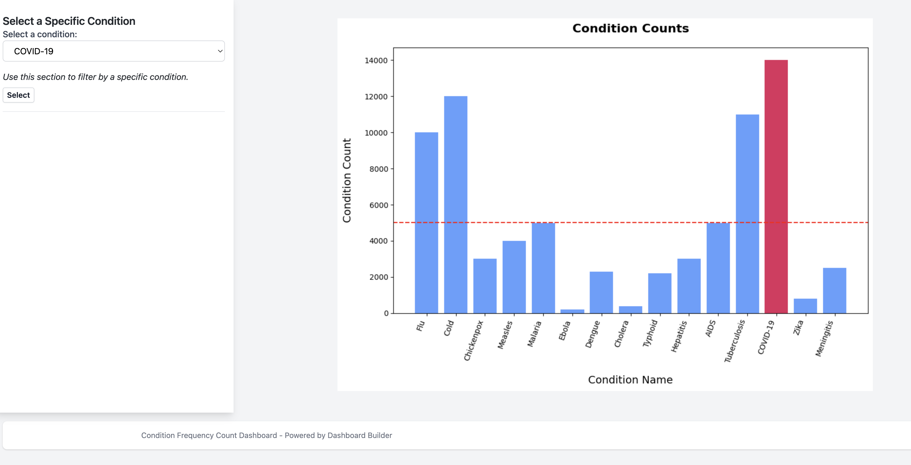

# Getting started with the dashboard builder

Welcome to the getting started guide for Dashboard Builder. In this first brief tutorial, we will set up a simple Flask application, and then guide you through integrating the dashboard builder package to create your first interactive web dashboard.

**What we will build:** In this first example, we are going to first build a simple flask application, to make sure we understand the basics and can get a flask application working. Next, using the Dashboard Builder library we will create a simple dashboard that has one user input component, and one output component. The input will be a single select dropdown, and the output will be a matplotlib plot.

*PS: If you want to skip and tutorial and just get the code, [click here](#10-complete-code)*

---



---

## Prerequisites

Before you begin, ensure you have:

- Python (3.9 to 3.12)
- Pip, the Python package manager.
- Basic knowledge of Python programming.

!!! note "Some Flask knowledge is recommended!"
    Dashboard Builder is dependent on Flask. If you have not worked with Flask before, we recommend that you briefly familiarize yourself with the Flask web development framework by reading the [official documentation](https://flask.palletsprojects.com/). A great tutorial or introduction to Flask is also the [The Flask Mega Tutorial](https://blog.miguelgrinberg.com/post/the-flask-mega-tutorial-part-i-hello-world) by Miguel Bringber

## Installation

First, if you haven't installed `dashboard-builder` yet, do so via pip. In addition, you should have *flask*, *matplotlib*, and *pandas* for this tutorial: 

```bash
pip install dashboard-builder
```

## Setting Up a Basic Flask Application

To understand the foundations, we will first create a simple Flask application that displays "Hello, World!". We will also bring in `render_template_string` and `request` from the flask library.  

### A. Create Flask App

Set up your basic Flask application. We are going to also enable two methods (`get` and `post`) for our initial endpoint. This will be critically for not only displaying information, but receiving the inputs from the user via a post request. 

```python
from flask import Flask, render_template_string, request
app = Flask(__name__)

@app.route('/', methods=['GET', 'POST'])

def hello_world():
    return 'Hello, World!'

if __name__ == "__main__":
    app.run(debug=True)
```

Save this script as `app.py` and run it:

```bash
python app.py
```

Visit `http://localhost:5000` in your web browser. You should see the message "Hello, World!".


### B. Integrating the Dashboard Builder

Now that you have a running Flask app, let's integrate `dashboard-builder`. 

#### 1. Imports

Start by importing the necessary components from `dashboard-builder`. We will bring in the components manager, along with one input and one output component. 

First, we bring in our dashboard `Config`. Currently we can use this to provide a custom footer, or load in our own custom templates which we will learn about later. 

Next we bring in the `ComponentManager`. This is Dashboard Builder's way of dealing with the components (think of components as the inputs and outputs to our dashboard) that we want to register to our flask application. A component manager should then be loaded into a specific flask endpoint, like `/` or `/dashboard` where you want to a user to interact or view a Dashboard Builder component. Your app can have multiple dashboards across multiple end points. We will explore this in a advanced tutorial.

Next, we are going to bring in the `FormGroup`. The form group serves as a container for either one input compoments, or many input compoments, that you would like the user to interact with. In addition, you can have one form group, or many form groups on a specific endpoint. We will cover the form group in more details later, or please visit [this section]() for more documentation on the form group.

For our input, we bring in `InputDropdown`, which will be a select select dropdown. 
For our output, we will bring in `OutputChart_Matplotlib`, which will be a matplotlib output. 

Lastly, we will also bring in `get_dashboard_template`, which allows us to select between one of two out of the box dashboard templates to house our inputs and outputs. As we will learn later, you can then also created your own custom dashbord templates and load them in via this mechanism. 


```python
from dashboard_builder.config import Config
from dashboard_builder.components.managers import ComponentManager
from dashboard_builder.components.inputs import InputDropdown
from dashboard_builder.components.outputs import OutputChart_Matplotlib
from dashboard_builder.get_dashboard_template
```

Lastly, we will bring in pandas and our matplotlib library, which will have a special `Agg` argument for file writing:

```python
import pandas as pd
import matplotlib
matplotlib.use('Agg') # required for Flask to serve matplotlib images
import matplotlib.pyplot as plt
```

!!! note "Matploblib writing in web servers!!"
    When using matplotlib in a server environment we need to set a specific argument after loading in matplotlib: `matplotlib.use('Agg')`. This step is required for rendering any matplotlib visualizations in a flask-based web application. The `Agg` argument is used for file writing in our Flask app. For more information, please visit the matplotlib [documentation on backends](https://matplotlib.org/stable/users/explain/figure/backends.html) to see all that is possible. 


#### 2. Compoment Manager 

Inside one of our first endpoint, which is `/`, we will now create an object (variable) to house our component manager. At this point, we can also set our config options for this tutorial, which will just be providing a custom name for our footer bar.  
 

```python

dashboard_settings = Config(
    footer_text="Condition Frequency Count Dashboard - Powered by Dashboard Builder"
)

@app.route('/', methods=['GET', 'POST'])
def index():

    manager = ComponentManager(request)
```

I recommend that you call this object `manager`, but obviously you can call it whatever you want. 

#### 3. Dummy data 

Now we will create some fake data, and use that to populate our first input compoment, which will be a drop down. Based on our data, we will then assign one of the column values to be the range inputs. Since I work in healthcare, we are going to come up with some conditions and fake counts for each. 

```python

## Creating a fake dataset 
df = pd.DataFrame({
    'condition': ['Flu', 'Cold', 'Chickenpox', 'Measles', 'Malaria', 'Ebola', 'Dengue', 'Cholera', 'Typhoid', 'Hepatitis', 'AIDS', 'Tuberculosis', 'COVID-19', 'Zika', 'Meningitis'],
    'condition_count': [10000, 12000, 3000, 4000, 5000, 200, 2300, 400, 2200, 3000, 5000, 11000, 14000, 800, 2500]
})

```

#### 4. Form Group

For our form group, we have a few arguments here to choose between:

- `action_url`: it defaults to `/`, so if you are creating this input on a non-index page, please update the endpoint path. 
- `markdown_top`: if you want markdown at the top of your form group, say a form header, insert it here 
- `markdown_bottom`: if you want markdown at the bottom of your form group, say a footnote, insert it here

```python

form_group_one = FormGroup(
    action_url='/', 
    markdown_top="""### Select a Specific Condition""", 
    markdown_bottom="""*Use this section to filter by a specific condition.*""") 

```

#### 5. Input Compoment

Next we will create the input compoment. After we have created our input, we will then add it the form group that we want. In this instance, we will add it to our `form_group_one` that we just created. 

The main arguments we have for our input drop down are:

- `name`: needs to be a unique name
- `label`: instructions for the user, what they see in the dashboard
- `values`: the data fields that the user should be able to select from. you can provide either a list, or a tuple like in this instance where we are providing the name of the dataframe, followed by the column within it of interest. 

```python

input_dropdown = InputDropdown(
    name='condition_selection', 
    label='Select a condition:', 
    values=(df, 'condition')) 

form_group_one.add_inputs(input_dropdown) #registering input to form group

```

!!! note "'Select All' for Input Components"
    Be default, each input compoment will automagically insert in a 'Select All' option to your value set. 

Once we have created the input_dropdown and added it to our form group, we can now register both the input compoment and the form group to our compoment manager that we created earlier called `manager` by doing the following:


```python

manager.inputs(input_dropdown)
manager.form_groups(form_group_one)

```

#### 6. Input Retrieval  

Now based on what the user does with the dropdown, we want to be able to receive that information, and just our dataframe and matplotlib visualization. 

Once the user selects a dropdown, we can retrieve what the user selects by calling the name of the variable we created for the input and add a `.value` to it for value retrieval. For us, lets save that as a new variable called `user_selected` and then manipulate the dataframe based on what they have selected. 

```python

user_selected = input_dropdown.value

```

#### 7. Data Manipulation

Because we want to change the df based on the user input, we will create a new version of the df that changes based on what the user selects. If there is no value selected and the user has not selected the 'select all' option, we will then filter the dataframe based on what they selected; else we will just display everything. 

```python

if user_selected and user_selected != 'Select All':
    output_df = df[df['condition'] == user_selected]
else:
    output_df = df

```

Thats it the data manipulation! Now we use matploblib to create a visualization based on the data that has been selected: 

```python

fig, ax = plt.subplots(figsize=(10, 7))

main_color = '#1f75fe'  
highlight_color = '#ee204d' 

ax.bar(df['condition'], df['condition_count'], color=main_color, alpha=0.7, label='All Conditions') 
ax.bar(output_df['condition'], output_df['condition_count'], color=highlight_color, alpha=0.9, label='Selected Condition') 
ax.axhline(y=df['condition_count'].mean(), color='red', linestyle='--', label=f'Mean: ${(df["condition_count"].mean()).round(2):,}') 

ax.set_xticklabels(df['Condition Name'], rotation=70, ha='right', fontsize=10)
ax.set_title('Condition Counts', fontsize=16, fontweight='bold', pad=20) 
ax.set_xlabel('Condition Name', fontsize=14, labelpad=15)
ax.set_ylabel('Condition Count', fontsize=14, labelpad=15)

fig.tight_layout()

```

#### 8. Output 

After we have gone our normal matplotlib work we can now take that visualization and output it to the user using our output compoment for matplotlib plots, and then register that output to our `manager` like what we did the for the inputs:

```python
output_1 = OutputChart_Matplotlib(fig)
manager.register_outputs(output_1)
```

#### 9. Return 

With each flask endpoint, we always must have a return. In order to build our dashboard, we utilize the `render_template_string` function from Flask to combine together our form groups (which contain are inputs) and our output components. In addition, we now bring in a pre-build template to display the information. Right now there are two basic templates to choose between: one that contains a side-bar widget for displaying inputs (`base`), and one that contains no-side bar (`base_nosidebar`) that is for dashboards that do not require user interaction. 

```python

return render_template_string(
    get_dashboard_template('base'),
    settings=dashboard_settings,
    form_groups=manager.render_form_groups(), 
    output_components=manager.render_outputs()
)

```

#### 10. Complete Code

Our complete code should look like this: 

```python

from flask import Flask, render_template_string, request
import pandas as pd 

import matplotlib
matplotlib.use('Agg') 
import matplotlib.pyplot as plt 

from dashboard_builder import get_dashboard_template 
from dashboard_builder.config import Config 
from dashboard_builder.components.managers import ComponentManager, FormGroup 
from dashboard_builder.config import Config 
from dashboard_builder.components.inputs import InputDropdown 
from dashboard_builder.components.outputs import OutputChart_Matplotlib 

app = Flask(__name__)

########################################################################
# Create a simple DataFrame
df = pd.DataFrame({
    'condition': ['Flu', 'Cold', 'Chickenpox', 'Measles', 'Malaria', 
                'Ebola', 'Dengue', 'Cholera', 'Typhoid', 'Hepatitis', 
                'AIDS', 'Tuberculosis', 'COVID-19', 'Zika', 'Meningitis'],
    'condition_count': [10000, 12000, 3000, 4000, 5000, 200, 
                        2300, 400, 2200, 3000, 5000, 11000, 
                        14000, 800, 2500]
})
########################################################################

dashboard_settings = Config(
    footer_text="Condition Frequency Count Dashboard - Powered by Dashboard Builder"
    )

@app.route('/', methods=['GET', 'POST'])
def index():

    manager = ComponentManager(request)

    # Creating our form group
    form_group_one = FormGroup(
        action_url='/',
        markdown_top="""### Select a Specific Condition""", 
        markdown_bottom="""*Use this section to filter by a specific condition.*""") 
    
    # Creating our first input component, and then regstering it othe form group 
    input_dropdown = InputDropdown(
        name='condition_selection', 
        label='Select a condition:', 
        values=(df, 'condition')) 
    
    form_group_one.add_inputs(input_dropdown)

    ########################################################################
    # Registering our input and form group to the manager 
    manager.register_inputs(input_dropdown)
    manager.register_form_groups(form_group_one)

    # User selected value
    user_selected = input_dropdown.value

    ########################################################################
    # Create filter DF based on user value
    if user_selected and user_selected != 'Select All':
        output_df = df[df['condition'] == user_selected]
    else:
        output_df = df


    ########################################################################
    # Create matplotlib chart
    fig, ax = plt.subplots(figsize=(10, 7))

    main_color = '#1f75fe'  
    highlight_color = '#ee204d' 

    ax.bar(df['condition'], df['condition_count'], color=main_color, alpha=0.7, label='All Conditions') 
    ax.bar(output_df['condition'], output_df['condition_count'], color=highlight_color, alpha=0.9, label='Selected Condition')  
    ax.axhline(y=df['condition_count'].mean(), color='red', linestyle='--', label=f'Mean: ${(df["condition_count"].mean()).round(2):,}') 

    # Fonts and rotations for labels
    ax.set_xticklabels(df['condition'], rotation=70, ha='right', fontsize=10)
    ax.set_title('Condition Counts', fontsize=16, fontweight='bold', pad=20) 
    ax.set_xlabel('Condition Name', fontsize=14, labelpad=15)
    ax.set_ylabel('Condition Count', fontsize=14, labelpad=15)

    fig.tight_layout()

    ########################################################################
    # Register the outputs 
    output_1 = OutputChart_Matplotlib(fig)
    manager.register_outputs(output_1)


    ########################################################################
    return render_template_string(
        get_dashboard_template('base'),
        settings=dashboard_settings,
        form_groups=manager.render_form_groups(), 
        output_components=manager.render_outputs()
    )

if __name__ == "__main__":
    app.run(debug=True)


```

Refresh `http://localhost:5000` to view your enhanced dashboard with interactive widgets!

## Troubleshooting

- *Method Not Allowed*: It is likely that you did not update the `/` endpoint to be able to `get` and `post`. The `get` is for display, and the `post` is required to receive the user input. If you do not allow the endpoint to do both, it will throw this error. 

--- 

Congrats on finishing! 

## Next 

For advanced tutorials and more examples, visit the [Examples](/examples) page. If you face any issues not addressed here, check our [FAQs](/faqs) or raise an issue on our [GitHub repository](https://github.com/your_github/dashboard-builder).


